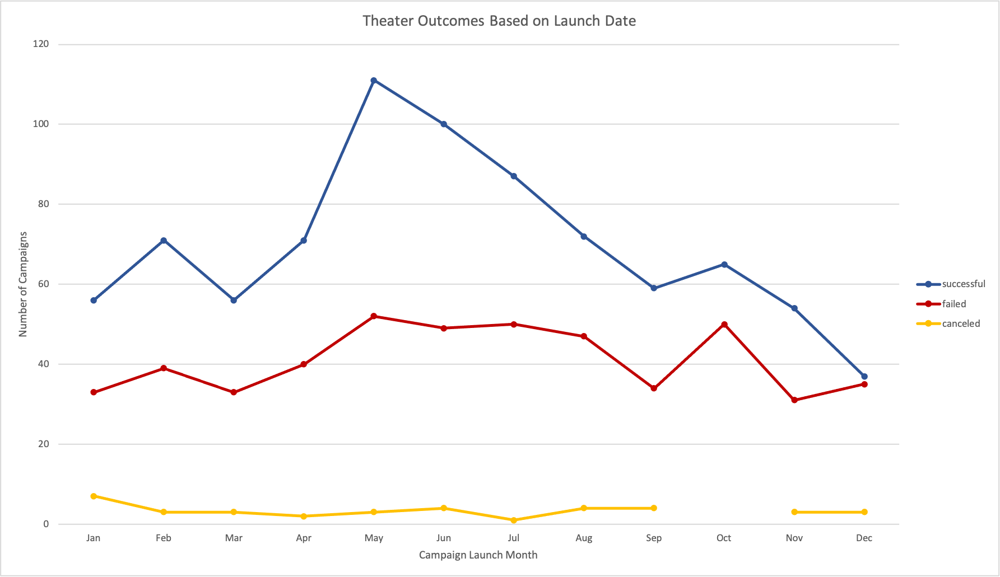

# Kickstarting with Excel

## Overview of Project
Excel Analysis of Play Kickstarter Campaigns

### Purpose
The purpose of this analysis is to determine how different play Kickstarter Campaigns fared in relation to their launch dates and their funding goals.

## Analysis and Challenges
Analysis was performed using Excel data provided by Louise.  Charts were created to visualize data to aid in gaining incites.  See images below.

### Analysis of Outcomes Based on Launch Date

### Analysis of Outcomes Based on Goals

### Challenges and Difficulties Encountered
#### Theater_Outcomes_vs_Launch Chart
Possible Challenges Include:
* Filtering the date range to only show months
* Adding axis lables to ensure understanding of chart

#### Outcomes_vs_Goals Chart
Possible Challenges Include:
* Adding axis lables to ensure understanding of chart
* To avoid incorrectly typing/retyping numbers and text into formulas for the table referenced by this chart, I created a table of cells that were referenced in the formulas instead (See cells K3 through L12 for breakout of goal ranges, and cells M3 through O3 for list of outcomes below).

## Results

- What are two conclusions you can draw about the Outcomes based on Launch Date?
1. More successful campaigns were launched in May than any other month.
2. The least number of successful campaigns started in December.

- What can you conclude about the Outcomes based on Goals?
 * A larger percentage (75.81%) of campaigns with goals below $1000 met or exceeded their goal.
 * The lower the goal range, the more successful campaigns occur.

- What are some limitations of this dataset?
 * The dataset only includes data that Louise has gathered.  There may be additional useful data of which she is unaware.
    * The dataset only goes back to 2009
    * The data does not provide any background information about the backers which may be helpful such as address, age, gender, income brackett, etc...
    * The larger the goal range, the less data points available to make an informed decision.

- What are some other possible tables and/or graphs that we could create?
We could look at:
     * Outcomes vs. Country
     * Outcomes vs. Length of Campaign
     * Outcomes vs. Staff Pick
